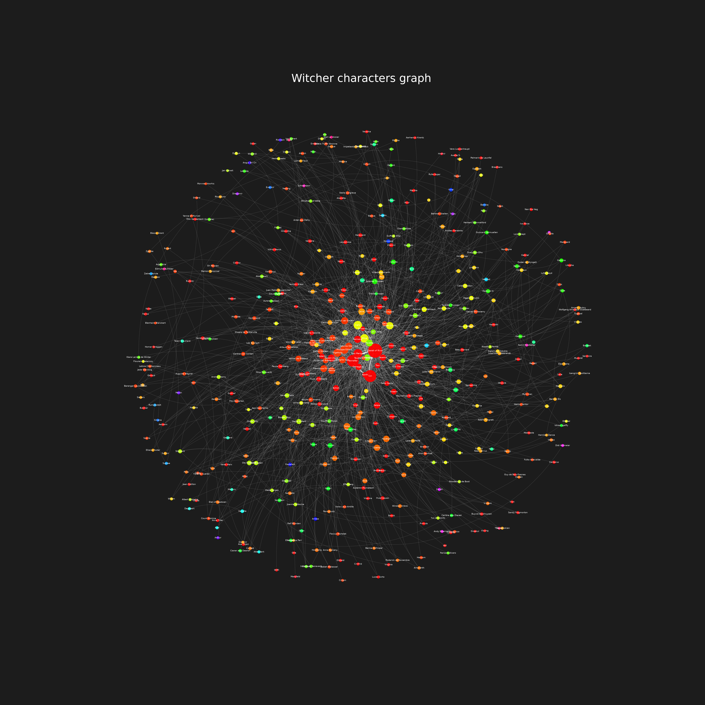

# Witcher Relationship Connections Graph

A student project for the Complex Systems course: a weighted social network of Witcher saga characters. It analyses centrality, communities, motifs and random-network models, and ends with a custom edge-anomaly detection algorithm.



## Requirements

- Python 3.12
- Dependencies listed in `requirements.txt` (networkx, matplotlib, seaborn, numpy, pandas, scipy, python-louvain, node2vec, umap-learn)

```sh
pip install -r requirements.txt
```

A Nix flake (`flake.nix`) is also provided for a reproducible environment. It also includes MiKTeX for building the LaTeX report:

```sh
nix develop
```

## Data

`data/connections.csv` was created by `src/connections.py` from the Witcher books in `.txt` format (not included in the repo):

1. spaCy (`en_core_web_sm`) finds the named entities in every sentence of each book.
2. Entities are matched against the 478 names in `data/characters.csv`, by full name or by a unique first name.
3. Characters mentioned one after another within a window of 5 sentences are linked.
4. Links from all books are merged into undirected pairs. The weight is the number of co-occurrences.

The result has about 1,640 weighted edges (`character1,character2,weight`).

## File structure

Each assignment folder has an `instruction.md` (the task, in Polish) and a `solution.py` that prints its results and saves plots to `figures/`.

- `src/connections.py` – builds the character graph from the books.
- `src/utils.py` – shared helpers: graph loading, colours and printing.
- `src/centrality/` – graph type, order and size, node and edge centrality measures, adjacency and incidence matrices, and a drawing of the graph.
- `src/properties/` – density, diameter, path lengths, shortest paths, centrality distributions, PageRank, connected components, k-connectivity and cliques.
- `src/communities/` – Greedy Modularity, Louvain and Label Propagation communities, drawn with a force-directed layout and a node2vec + UMAP embedding.
- `src/random_networks/` – comparison of the real network with Erdős–Rényi and Barabási–Albert networks, with a report (`raport.md`).
- `src/link_prediction/` – Common Neighbors and Jaccard link prediction on daily and 30-day windows of the university's email dataset (`data/email_data/`, not included).
- `src/motifs/` – 3- and 4-node motifs compared with a Barabási–Albert network, their statistical significance, and network resilience to node removal.
- `src/algorithm/` – my own algorithm for detecting anomalous edges, with a LaTeX report (`raport.tex`, built with `build-raport`).

## Anomalous edge detection

The custom algorithm (`src/algorithm/`) finds edges that are unusual shortcuts between two peripheral characters. Minor characters normally reach each other through hubs like Geralt or Ciri, so a direct link between two minor characters who would otherwise be far apart stands out. For every edge `(u, v)`:

1. `hubness` – each node's degree rank scaled to `[0, 1]`.
2. `hops` – the shortest path from `u` to `v` with the edge temporarily removed. Edges with no other path are skipped.
3. `periph = (1 − hubness(u)) · (1 − hubness(v))` – close to 1 when both ends are minor characters.
4. `score = hops · periph` – the top 1% of edges by score are marked as anomalies.

Detour length alone would also flag links between hubs, which are normal in a social network. Weighting it by peripherality leaves only the shortcuts that skip the hubs.
