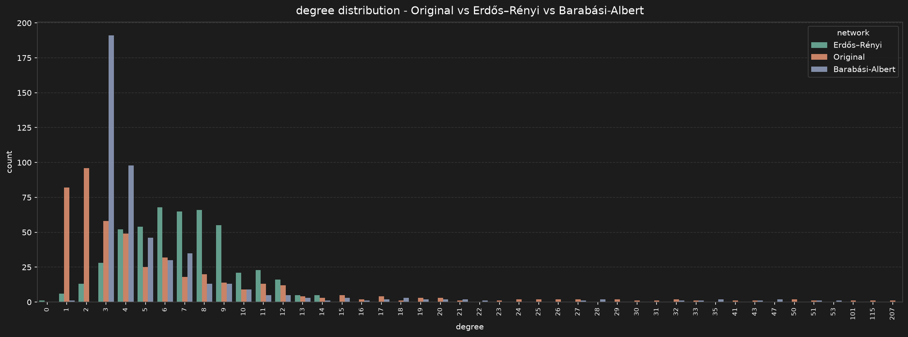
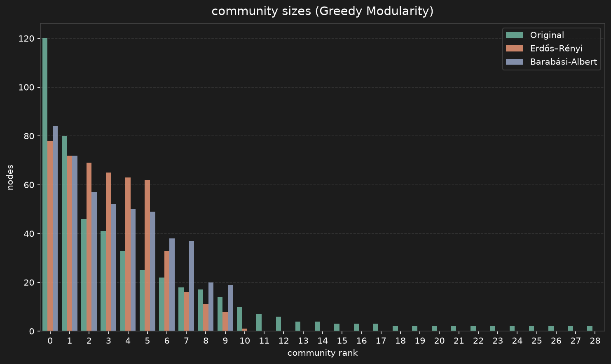
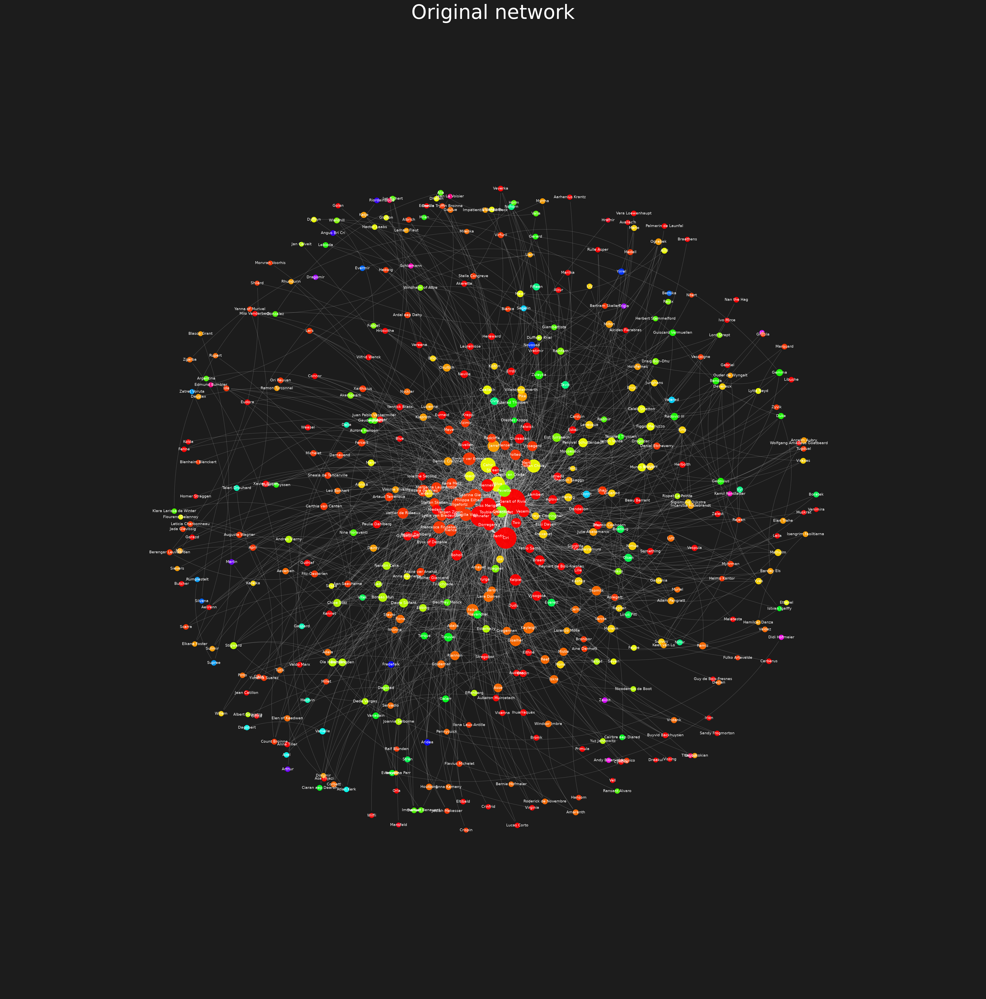
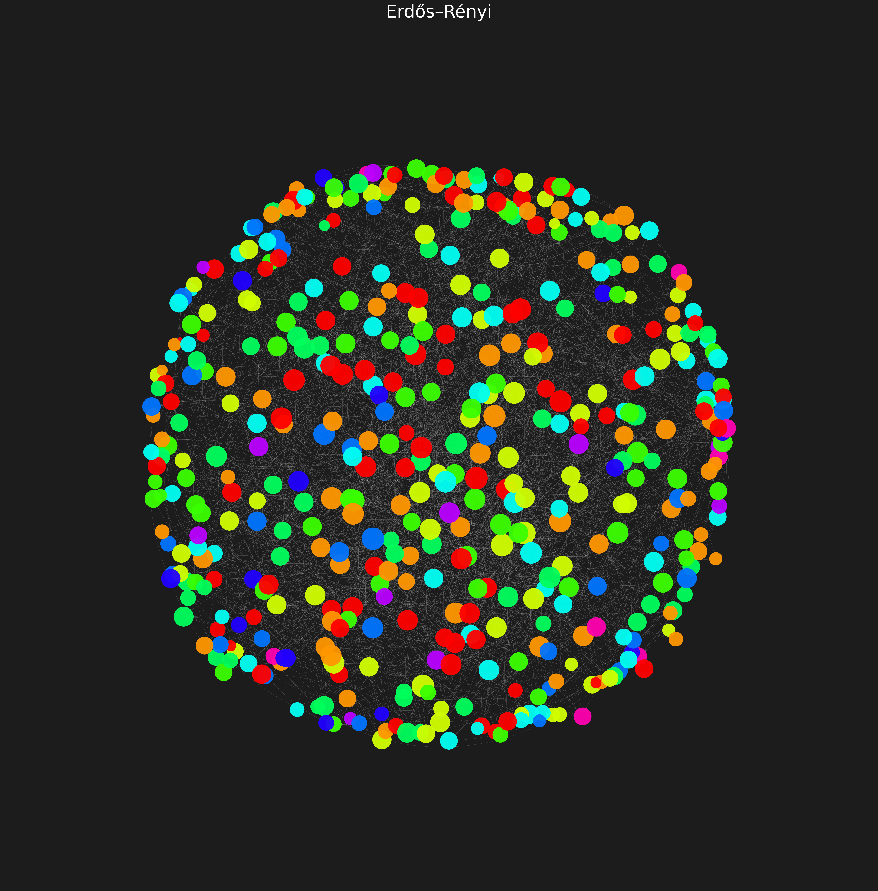
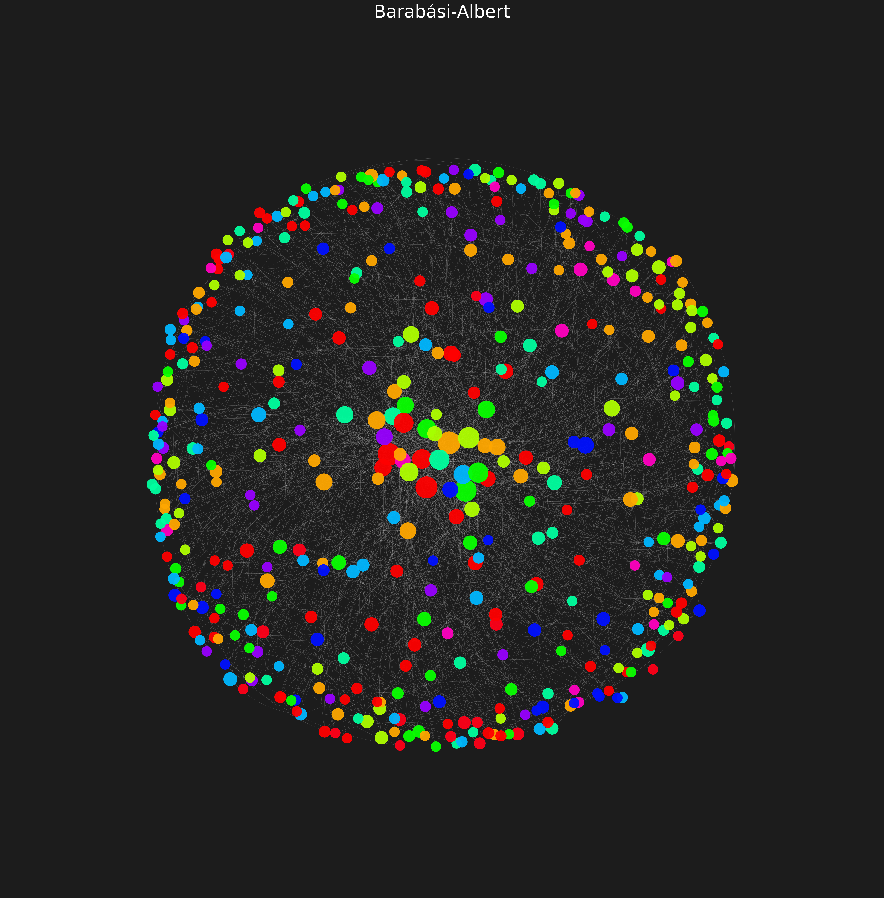

## 1. Podstawowe parametry sieci

_Polecenie: sieci losowe o zbliżonej liczbie węzłów/krawędzi; porównanie gęstości, średniej długości ścieżki i składowych spójnych._
Wyniki pokazują, że ER i BA mają zbliżoną gęstość do oryginału, ale niższy współczynnik grupowania i mniej składowych spójnych.

```
========================== Original - basic properties ===========================

Nodes: 478
Edges: 1638
Density: 0.014368
Connected components: 10
Largest component: 458 nodes
Average path length: 2.9976
Avg clustering coeff: 0.4145

=========================== Erdős–Rényi - basic properties ===========================

Nodes: 478
Edges: 1635
Density: 0.014342
Connected components: 2
Largest component: 477 nodes
Average path length: 3.4241
Avg clustering coeff: 0.0117

=========================== Barabási-Albert - basic properties ===========================

Nodes: 478
Edges: 1425
Density: 0.012500
Connected components: 1
Largest component: 478 nodes
Average path length: 3.2039
Avg clustering coeff: 0.0461
```

---

## 2. Najważniejsze węzły wg stopnia

_Polecenie: rozkład stopni wierzchołków (oraz własności z Zadań 1–2)._

Oryginał ma silne huby (Geralt 207, Ciri 115, Yennefer 101), ER jest niemal płaski (max ~14), a BA daje pośrednie huby.

```
=========================== Original - top nodes by degree ===========================

Geralt of Rivia 207
Ciri 115
Yennefer 101
Emhyr var Emreis 51
Philippa Eilhart 50
Falka 50
Vilgefortz 43
Triss Merigold 41
Milva 33
Yarpen Zigrin 32

=========================== Erdős–Rényi - top nodes by degree ===========================

6 14
14 14
248 14
376 14
422 14
32 13
104 13
106 13
229 13
457 13

=========================== Barabási-Albert - top nodes by degree ===========================

4 53
6 51
0 47
8 47
14 43
13 35
26 35
9 33
11 32
21 28
```

---

## 3. Rozkłady miar centralności

_Polecenie: dowolne inne własności z Zadań 1 i 2._

Dla każdej sieci podano statystyki (min / max / mean / median / std) rozkładów: stopnia, bliskości (closeness), pośrednictwa węzłów i krawędzi.
Najwyższe wartości ma oryginał - odzwierciedla to obecność wyraźnych hubów, których nie ma w sieciach losowych.

```
=========================== Original - degree distribution ===========================

Min: 0.0021
Max: 0.4340
Mean: 0.0144
Median: 0.0084
Std: 0.0280

=========================== Original - closeness distribution ===========================

Min: 0.0021
Max: 0.5716
Mean: 0.3169
Median: 0.3335
Std: 0.0858

=========================== Original - node betweenness distribution ===========================

Min: 0.0000
Max: 0.4765
Mean: 0.0039
Median: 0.0001
Std: 0.0240

=========================== Original - edge betweenness distribution ===========================

Min: 0.0000
Max: 0.0278
Mean: 0.0017
Median: 0.0008
Std: 0.0023

=========================== Erdős–Rényi - degree distribution ===========================

Min: 0.0000
Max: 0.0294
Mean: 0.0143
Median: 0.0147
Std: 0.0056

=========================== Erdős–Rényi - closeness distribution ===========================

Min: 0.0000
Max: 0.3415
Mean: 0.2924
Median: 0.2954
Std: 0.0246

=========================== Erdős–Rényi - node betweenness distribution ===========================

Min: 0.0000
Max: 0.0178
Mean: 0.0051
Median: 0.0044
Std: 0.0037

=========================== Erdős–Rényi - edge betweenness distribution ===========================

Min: 0.0008
Max: 0.0049
Mean: 0.0021
Median: 0.0020
Std: 0.0005

=========================== Barabási-Albert - degree distribution ===========================

Min: 0.0021
Max: 0.1111
Mean: 0.0125
Median: 0.0084
Std: 0.0132

=========================== Barabási-Albert - closeness distribution ===========================

Min: 0.2491
Max: 0.4690
Mean: 0.3148
Median: 0.3124
Std: 0.0302

=========================== Barabási-Albert - node betweenness distribution ===========================

Min: 0.0000
Max: 0.1420
Mean: 0.0046
Median: 0.0011
Std: 0.0136

=========================== Barabási-Albert - edge betweenness distribution ===========================

Min: 0.0002
Max: 0.0136
Mean: 0.0022
Median: 0.0017
Std: 0.0016
```

---

## 4. Struktura społeczności (Greedy Modularity)

_Polecenie: zastosować algorytm grupowania uznany za najlepszy w Zadaniu 3 i porównać liczbę grup, współczynnik grupowania, rozkład wielkości grup oraz modułowość._ Ten sam algorytm uruchomiono na wszystkich trzech sieciach. Kluczowy kontrast: oryginał ma **29 grup** o bardzo nierównej wielkości (od 2 do 120, mediana 4) przy podobnej modułowości Q, podczas gdy sieci losowe dzielą się na **~10–11 grup zbliżonej wielkości**. Czyli losowe potrafią mieć podobne Q, ale nie odtwarzają rozkładu grup ani współczynnika grupowania.

```
=========================== Original - Greedy Modularity communities ===========================

Communities: 29
Modularity Q: 0.3830
Avg clustering coeff: 0.4145
Size min/max/mean/median: 2 / 120 / 16.5 / 4.0
Top sizes: [120, 80, 46, 41, 33, 25, 22, 18, 17, 14]

=========================== Erdős–Rényi - Greedy Modularity communities ===========================

Communities: 11
Modularity Q: 0.3662
Avg clustering coeff: 0.0117
Size min/max/mean/median: 1 / 78 / 43.5 / 62.0
Top sizes: [78, 72, 69, 65, 63, 62, 33, 16, 11, 8]

=========================== Barabási-Albert - Greedy Modularity communities ===========================

Communities: 10
Modularity Q: 0.3897
Avg clustering coeff: 0.0461
Size min/max/mean/median: 19 / 84 / 47.8 / 49.5
Top sizes: [84, 72, 57, 52, 50, 49, 38, 37, 20, 19]
```

---

## 5. Wizualizacje

_Polecenie: graficzna wizualizacja każdej sieci oraz społeczności, z wybraną własnością wierzchołków/krawędzi._

Rozkład stopni trzech sieci obok siebie:



Rozkład wielkości społeczności (Greedy Modularity):



Grafy kolorowane wg społeczności; rozmiar węzła = stopień ważony
(wybrana własność wierzchołka):






